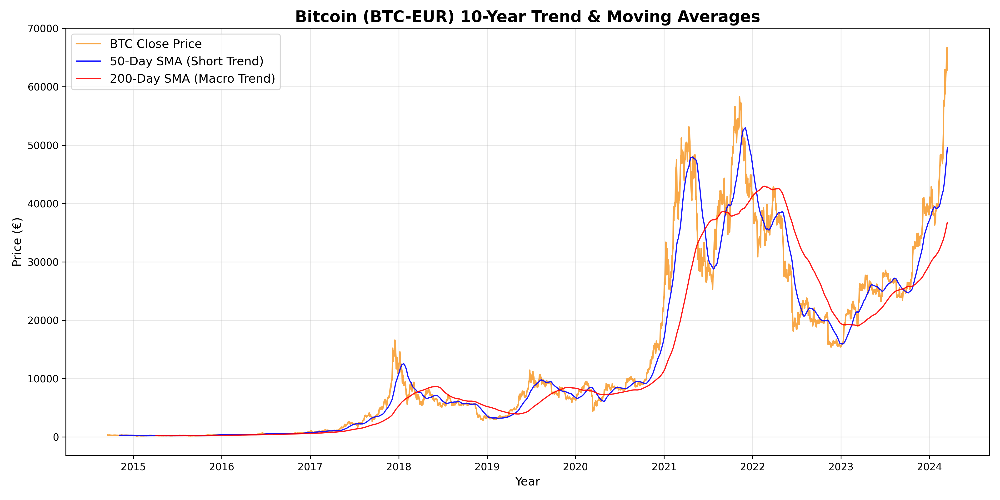

# btc-eur-market-cycles
A Python project where I find a decade of Bitcoin prices to see if traditional stock market math can actually spot crypto bull runs.




# 📈 10 Years of Bitcoin: A Python Data Analysis

## Project Introduction
Everyone talks about Bitcoin's wild price swings, but I wanted to look past the hype and analyze the raw data. This project explores a massive dataset containing 10 years of daily Bitcoin prices (in Euros) from 2014 to 2024. 

Instead of just drawing a static chart, I built a Python-based data engine. When executed, the script automatically ingests the dataset, applies financial algorithms, visualizes the macro trends, and prints a real-time market report to the console.

## Purpose
The main goal of this project was to determine if traditional stock market math could successfully track and predict cryptocurrency market cycles. 

I set out to answer three specific research questions:
1. **What is the actual, mathematical macro growth of Bitcoin over the last decade?**
2. **Can traditional financial indicators (like Simple Moving Averages) cut through crypto volatility?**
3. **Can code mathematically identify historic "Bull" (growth) and "Bear" (decline) markets?**

## Data Modifications & Engineering
Raw financial data is rarely ready for analysis right out of the box. To get the dataset ready for the visualization and reporting engine, I used `pandas` to perform the following data modifications:
* **Time-Series Conversion:** Parsed the raw string dates into indexable Python `Datetime` objects to ensure accurate chronological plotting.
* **Trend Smoothing (Rolling Windows):** Applied a `rolling(window=X).mean()` function to the daily closing prices to calculate the **50-Day** (short-term trend) and **200-Day** (macro trend) Simple Moving Averages.
* **Signal Generation:** Engineered a new data column to track crossovers between the 50-day and 200-day averages, allowing the script to programmatically detect market shifts.

## Automated Findings (Terminal Output)
The script doesn't just process the data behind the scenes—it answers the research questions by printing this exact report directly into the terminal:

```text
----------------------------------------
 BITCOIN MACRO TREND REPORT
----------------------------------------
Start Date:  2014-09-18 | Price: €328.54
End Date:    2024-03-15 | Price: €62,881.39
Total Macro Growth: 19,039.68%

 RECENT GOLDEN CROSSES (Bull Market Start):
   -> 2021-09-12 at €38,997.03
   -> 2023-02-15 at €22,735.56
   -> 2023-10-26 at €32,653.23

 RECENT DEATH CROSSES (Bear Market Start):
   -> 2021-06-19 at €30,019.23
   -> 2022-01-18 at €37,403.79
   -> 2023-09-13 at €24,023.85
----------------------------------------


Data source: Kaggle:
The data source has been imported from Kaggle.
